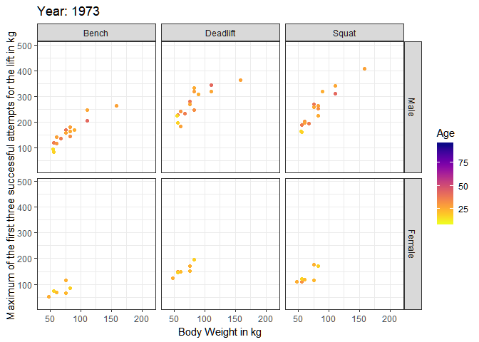

```r
library(ggplot2)
library(gganimate)
library(tidyverse)
```

```
## -- Attaching packages ---------------------------------------------------------- tidyverse 1.2.1 --
```

```
## v tibble  2.1.3     v purrr   0.3.3
## v tidyr   1.0.0     v dplyr   0.8.3
## v readr   1.3.1     v stringr 1.4.0
## v tibble  2.1.3     v forcats 0.4.0
```

```
## -- Conflicts ------------------------------------------------------------- tidyverse_conflicts() --
## x dplyr::filter() masks stats::filter()
## x dplyr::lag()    masks stats::lag()
```

```r
library(viridis)
```

```
## Loading required package: viridisLite
```

## Read in data

```r
df <- readr::read_csv("https://raw.githubusercontent.com/rfordatascience/tidytuesday/master/data/2019/2019-10-08/ipf_lifts.csv")
```

```
## Parsed with column specification:
## cols(
##   name = col_character(),
##   sex = col_character(),
##   event = col_character(),
##   equipment = col_character(),
##   age = col_double(),
##   age_class = col_character(),
##   division = col_character(),
##   bodyweight_kg = col_double(),
##   weight_class_kg = col_character(),
##   best3squat_kg = col_double(),
##   best3bench_kg = col_double(),
##   best3deadlift_kg = col_double(),
##   place = col_character(),
##   date = col_date(format = ""),
##   federation = col_character(),
##   meet_name = col_character()
## )
```

## Clean data

```r
df2 <- df %>% mutate(year = as.numeric(str_sub(date, 1, 4))) %>%
  select(year, sex, age, bodyweight_kg, best3squat_kg, best3bench_kg, best3deadlift_kg) %>%
  gather("type", "value", - year, - sex, - age, - bodyweight_kg) %>%
  mutate(sex = recode(sex, "F"="Female", "M"="Male"),
         sex = fct_relevel(sex, "Male"),
         type = recode(type, 
                       "best3bench_kg"="Bench",
                       "best3deadlift_kg"="Deadlift",
                       "best3squat_kg"="Squat"),
         year = as.integer(year)) 
```

## Create data viz 

```r
ggplot(df2 %>% filter(value>0 & age > 0.5), 
       aes(x=bodyweight_kg, y=value, col = age) ) +
  geom_point() +
  facet_grid(sex~type) +
  scale_color_viridis(direction = -1, option = "plasma", 
                      name = "Age")+
  theme_bw() +
  # gganimate specific bits:
  labs(title = 'Year: {frame_time}', 
       x = 'Body Weight in kg', 
       y = 'Maximum of the first three successful attempts for the lift in kg') +
  transition_time(year) +
  ease_aes('linear')
```

```
## Warning: Removed 3 rows containing missing values (geom_point).

## Warning: Removed 3 rows containing missing values (geom_point).
```

```
## Warning: Removed 6 rows containing missing values (geom_point).
```

```
## Warning: Removed 12 rows containing missing values (geom_point).
```

```
## Warning: Removed 9 rows containing missing values (geom_point).
```

```
## Warning: Removed 1 rows containing missing values (geom_point).
```

```
## Warning: Removed 7 rows containing missing values (geom_point).
```

```
## Warning: Removed 15 rows containing missing values (geom_point).
```

```
## Warning: Removed 9 rows containing missing values (geom_point).
```

```
## Warning: Removed 13 rows containing missing values (geom_point).
```

```
## Warning: Removed 12 rows containing missing values (geom_point).

## Warning: Removed 12 rows containing missing values (geom_point).
```

```
## Warning: Removed 6 rows containing missing values (geom_point).
```

```
## Warning: Removed 22 rows containing missing values (geom_point).
```

```
## Warning: Removed 27 rows containing missing values (geom_point).
```

```
## Warning: Removed 29 rows containing missing values (geom_point).

## Warning: Removed 29 rows containing missing values (geom_point).
```

```
## Warning: Removed 2 rows containing missing values (geom_point).
```

```
## Warning: Removed 5 rows containing missing values (geom_point).
```

```
## Warning: Removed 12 rows containing missing values (geom_point).
```

```
## Warning: Removed 10 rows containing missing values (geom_point).
```

```
## Warning: Removed 31 rows containing missing values (geom_point).
```

```
## Warning: Removed 22 rows containing missing values (geom_point).
```

```
## Warning: Removed 28 rows containing missing values (geom_point).
```

```
## Warning: Removed 21 rows containing missing values (geom_point).

## Warning: Removed 21 rows containing missing values (geom_point).
```

```
## Warning: Removed 48 rows containing missing values (geom_point).
```

```
## Warning: Removed 76 rows containing missing values (geom_point).
```

```
## Warning: Removed 31 rows containing missing values (geom_point).
```

```
## Warning: Removed 65 rows containing missing values (geom_point).

## Warning: Removed 65 rows containing missing values (geom_point).
```

```
## Warning: Removed 39 rows containing missing values (geom_point).
```

```
## Warning: Removed 54 rows containing missing values (geom_point).
```

```
## Warning: Removed 18 rows containing missing values (geom_point).
```

```
## Warning: Removed 35 rows containing missing values (geom_point).
```

```
## Warning: Removed 29 rows containing missing values (geom_point).

## Warning: Removed 29 rows containing missing values (geom_point).
```

<!-- -->

