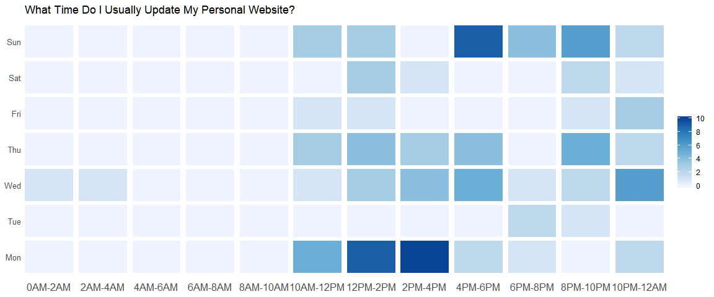

  

```r
library(rtweet)
suppressMessages(library(ggplot2))
```

```
## Warning: package 'ggplot2' was built under R version 3.6.2
```

```r
suppressMessages(library(lubridate))
suppressMessages(library(dplyr))
library(reticulate)
use_python("ProgramData/Anaconda3")
```


```python
import os
from github import Github
token = os.environ.get('GITHUB_TOKEN')
g = Github(token)
repo = g.get_repo("zhiiiyang/zhiyang")
commits = repo.get_commits()

message = []
date = []
for i in commits:
    message.append(i.commit.message)
    date.append(i.commit.committer.date)
    
```


```r
dates <- sapply(py$date, function(x) as.character(x))
dates <- force_tzs(ymd_hms(dates), tzones = "UTC", 
                   tzone_out = "America/Los_Angeles")

dat2 <- data.frame(wday = wday(dates, label = TRUE),
                   hour = floor(hour(dates)/2)) %>%
        mutate(wday = as.character(wday)) %>%
        group_by(wday, hour) %>%
        summarise(commit = n()) 
        

dat3 <- data.frame(wday = rep(wday(1:7, label = TRUE), each = 12), 
                   hour = rep(0:11, 7)) %>% 
        mutate(wday = as.character(wday)) %>%
        left_join(., dat2) %>%
        mutate(commit = ifelse(is.na(commit), 0, commit),
               wday = factor(wday, levels = wday(1:7, label = TRUE)[c(2:7,1)]))
```

```
## Joining, by = c("wday", "hour")
```


```r
ggplot(dat3, aes(hour, wday)) + 
  geom_tile(aes(fill = commit), width=0.9, height=0.9)+
  scale_fill_distiller(type = "seq", direction = 1) + 
  scale_x_continuous(breaks = 0:11,  expand = c(0, 0),
                     labels = paste(c(paste0(seq(0, 10, 2), "AM"), "12PM", 
                                      paste0(seq(2, 10, 2), "PM")), 
                                    c(paste0(seq(2, 10, 2), "AM"), "12PM", 
                                      paste0(seq(2, 10, 2), "PM"), "12AM"), sep ="-")) +
  ggtitle("What Time Do I Usually Update Personal Website?") + 
  theme_minimal() +
  theme(axis.ticks = element_blank(),
        axis.title = element_blank(),
        axis.text.y = element_text(size = 10),
        axis.text.x = element_text(size = 10),
        legend.title = element_blank(),
        panel.grid = element_blank())
```

<!-- -->

