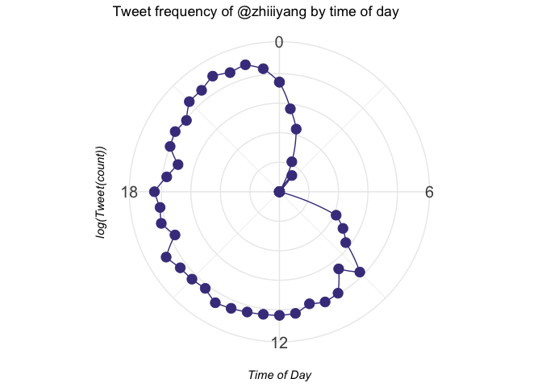

  

```r
library(rtweet)
suppressMessages(library(lubridate))
suppressMessages(library(dplyr))
library(tidyr)
library(ggplot2)
```


```r
token <- create_token(
  app = "rtweet_token_zy",
  consumer_key = Sys.getenv("consumer_key"),
  consumer_secret = Sys.getenv("consumer_secret"))
```


## Get my timeline

```r
targeted_user <- "zhiiiyang"
tweet_list <- get_timeline(targeted_user,n = 3000)
```

## Explore the tweets list 

```r
head(tweet_list)
```

```
## # A tibble: 6 × 43
##   created_at               id id_str        full_text truncated display_text_ra…
##   <dttm>                <dbl> <chr>         <chr>     <lgl>                <dbl>
## 1 2022-08-04 23:24:18 1.56e18 155543953476… @JeevunS… FALSE                  256
## 2 2022-08-04 23:19:06 1.56e18 155543822856… By the a… FALSE                  129
## 3 2022-08-04 23:12:10 1.56e18 155543648085… @Brett_F… FALSE                   74
## 4 2022-08-04 14:55:54 1.56e18 155531159167… @SagerTo… FALSE                   67
## 5 2022-08-04 08:29:32 1.56e18 155521435849… @imbarba… FALSE                   48
## 6 2022-08-04 07:55:37 1.56e18 155520582507… @cantsto… FALSE                   43
## # … with 37 more variables: entities <list>, source <chr>,
## #   in_reply_to_status_id <dbl>, in_reply_to_status_id_str <chr>,
## #   in_reply_to_user_id <dbl>, in_reply_to_user_id_str <chr>,
## #   in_reply_to_screen_name <chr>, geo <list>, coordinates <list>,
## #   place <list>, contributors <lgl>, is_quote_status <lgl>,
## #   retweet_count <int>, favorite_count <int>, favorited <lgl>,
## #   retweeted <lgl>, lang <chr>, possibly_sensitive <lgl>, …
```

### Tidy retweet lists

```r
radar_df <- tweet_list %>%
  mutate(created_at = with_tz(created_at, tzone = "America/Los_Angeles"), 
         hour = stringr::str_pad(hour(created_at), 2, pad = "0"),
         mins = minute(floor_date(created_at, "30 mins"))) %>% 
  unite(group, c("hour", "mins")) %>% 
  group_by(group) %>%
  summarise(tweets = n()) %>%
  select(group, tweets)

radar_df_com <- rbind(radar_df, 
                      data.frame(group = setdiff(paste0(rep(stringr::str_pad(0:23, 2, pad="0"), 
                                                       each = 2), "_", c(0,30)), radar_df$group),
                                 tweets = 0)) %>%
                mutate(group = (as.numeric(as.factor(group))- 1)/2) %>%
                arrange(group)

radar_df_com<- rbind(radar_df_com, 
                     data.frame(group = 24, radar_df_com[radar_df_com$group==0, "tweets"]))
```

## Create spider plot 

```r
ggplot(radar_df_com, aes(x = group, y = log(tweets))) +
  geom_point(size = 4, color = "darkslateblue") +
  geom_polygon(color = "darkslateblue", fill=NA) + 
  coord_polar(direction = 1) +
  ggtitle("Tweet frequency of @zhiiiyang by time of day") +
  ylab("log(Tweet(count))") +
  xlab("Time of Day") +
  scale_x_continuous(breaks = c(0, 6, 12, 18)) + 
  theme_minimal() +
  theme(axis.text.y=element_blank(),
        axis.title = element_text(face="italic"),
        axis.text.x = element_text(size = 15)) 
```

<!-- -->
