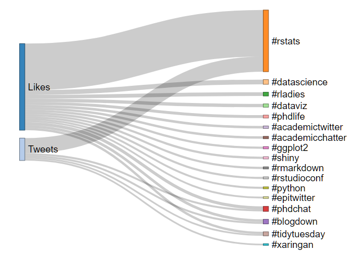
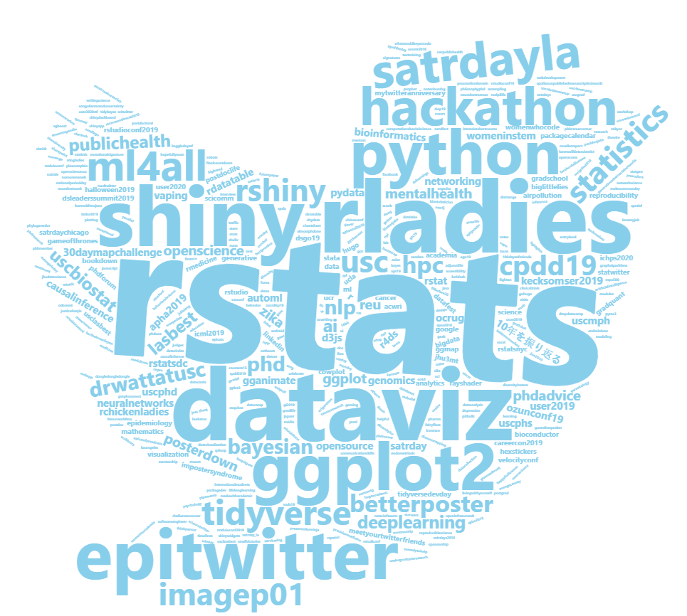

  
```{r}
library(rtweet)
library(lubridate)
suppressMessages(library(dplyr))
library(networkD3)
library(wordcloud2)

token <- get_tokens()
```

## Get my timeline
```{r}
targeted_user <- "zhiiiyang"
tweet_list <- get_timeline(targeted_user,n = 3000)
fav_list <- get_favorites(targeted_user, n = 3000)
dim(tweet_list)
dim(fav_list)
```

## clean hashtags by removing the `NA`
```{r}
tweet_hash <- unlist(tweet_list$hashtags)
tweet_hash <- tweet_hash[!is.na(tweet_hash)]
fav_hash <- unlist(fav_list$hashtags)
fav_hash <- fav_hash[!is.na(fav_hash)]

length(tweet_hash)
length(fav_hash)
```

## exclude hashtags less than 10 counts
```{r}
dat <- data.frame(source = c(rep("Tweets", length(tweet_hash)),
                             rep("Likes", length(fav_hash))),
                  target = paste0("#",
                                  c(tolower(tweet_hash), tolower(fav_hash))))

dat_sum <- dat %>% group_by(source, target) %>% 
           summarise(value = n()) %>%
           filter(value > 10) %>%
           arrange(desc(value))


nodes <- data.frame(name=c(as.character(dat_sum$source), 
                           as.character(dat_sum$target)) %>% unique())

dat_sum$IDsource=match(dat_sum$source, nodes$name)-1 
dat_sum$IDtarget=match(dat_sum$target, nodes$name)-1

```


## create the network
```{r eval=FALSE}
sankeyNetwork(Links = dat_sum, Nodes = nodes,
                      Source = "IDsource", Target = "IDtarget",
                      Value = "value", NodeID = "name", 
                      sinksRight=FALSE, fontFamily = "sans-serif",
              nodeWidth=10, fontSize=18, nodePadding=15)

```


## create the word cloud
```{r eval = FALSE}
figPath = system.file("examples/t.png",package = "wordcloud2")
Freq <- dat %>% group_by(target) %>% 
        summarise(value = as.numeric(n())) %>% 
        mutate(value = if_else(value>100, round(value/8), value)) %>%
        arrange(desc(value))
colnames(Freq) <- c("word", "freq")
Freq$word <- stringr::str_remove(Freq$word, "#")
wordcloud2(Freq, figPath = figPath, size = 1.5, color = "skyblue")
```


