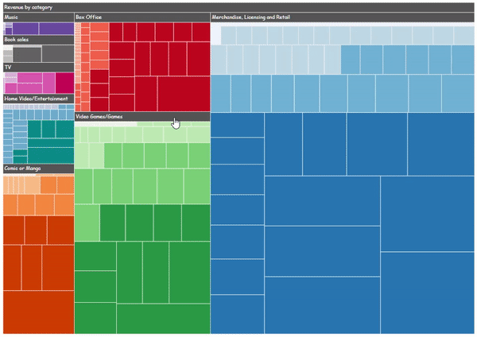
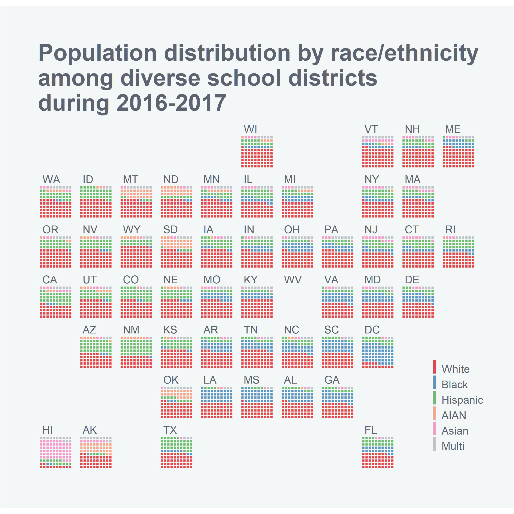
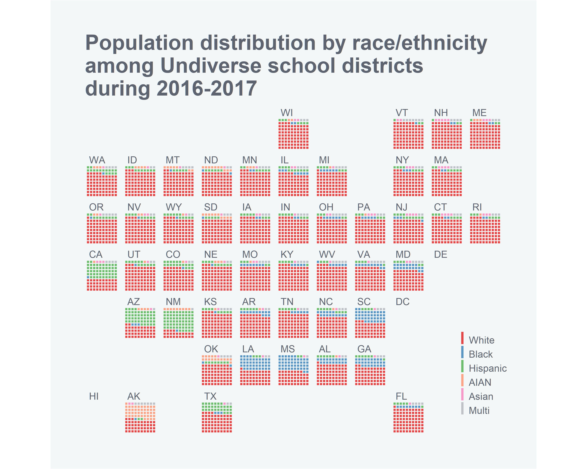
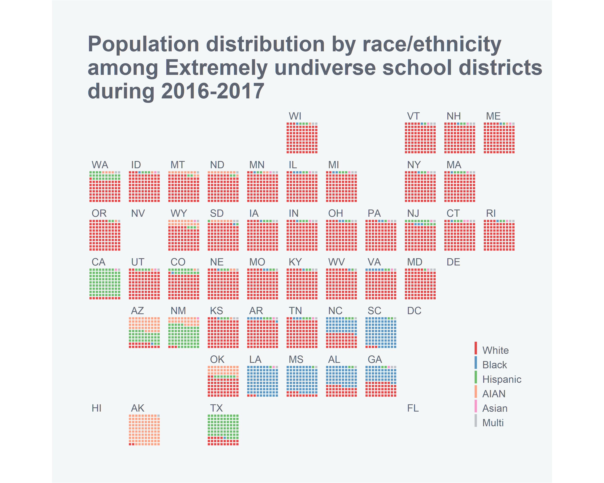
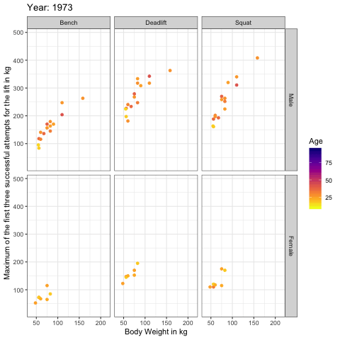
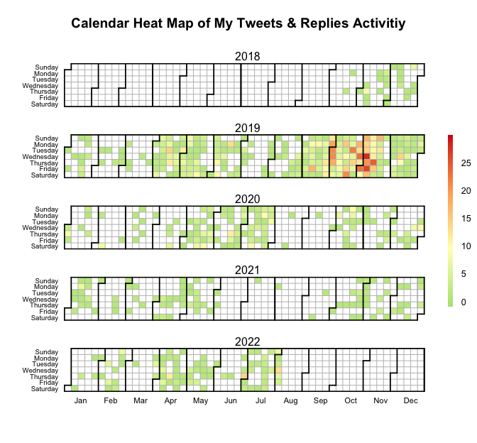
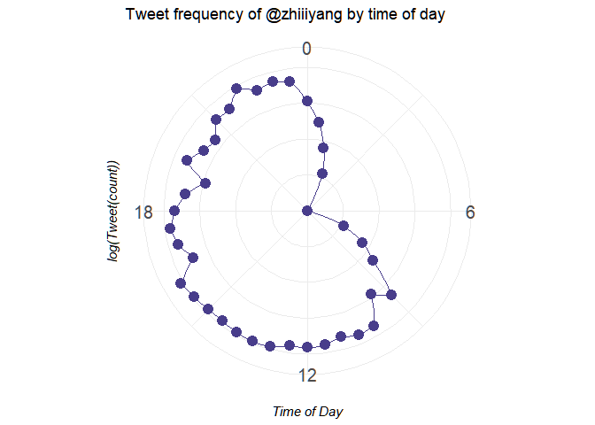

# My #dataviz projects [website](https://zhiyang.netlify.com/project/viz/)

- [How to make an interactive treemap using `treemap` and `d3treeR`](https://github.com/zhiiiyang/tidytuesday#how-to-make-an-interactive-treemap-using-treemap-and-d3treer)
- [How to make an geofacet waffle chat using `geofacet`](https://github.com/zhiiiyang/tidytuesday#how-to-make-an-geofacet-waffle-chat-using-geofacet)
- [How to make a map using `geofacet`](https://github.com/zhiiiyang/tidytuesday#how-to-make-a-map-using-geofacet)
- [How to make an animated picture using `gganimate`](https://github.com/zhiiiyang/tidytuesday/blob/master/README.md#how-to-make-an-animated-picture-using-gganimate)
- [How to make a heatmap of your Twitter activity using `ggplot2`](https://github.com/zhiiiyang/tidytuesday/blob/master/README.md#how-to-make-a-heatmap-of-your-twitter-activity-using-ggplot2)
- [How to make a radar/spider plot of your tweet frequency using `ggplot2`](https://github.com/zhiiiyang/tidytuesday#how-to-make-a-radarspider-plot-of-your-tweet-frequency-using-ggplot2)

## How to make an interactive treemap using `treemap` and `d3treeR` 

  

**Data**: introduction of #TidyTuesday media franchise data [here](https://github.com/rfordatascience/tidytuesday/tree/master/data/2019/2019-07-02)

**Code**: click [here](2019-07-02_media-franchise/script.R)

**Note**: to interact with the treemaps, please go to the [post](https://zhiyang.netlify.com/post/treemap/)

## How to make an geofacet waffle chat using `geofacet`  

  
  
  

**Data**: introduction of #TidyTuesday school diversity data [here](https://github.com/rfordatascience/tidytuesday/tree/master/data/2019/2019-09-24)

**Code**: click [here](2019-09-24_school-diversity/script.Rmd)

**Note**: go to [andriy-gazin/geowaffle](https://github.com/andriy-gazin/geowaffle) to see the original post

# How to make a map using `geofacet` 

  
  
  

# How to make an animated picture using `gganimate`

  

**Code**: click [here](https://github.com/zhiiiyang/tidytuesday/tree/master/2019-10-08_lifting)

# How to make a heatmap of your Twitter activity

  

**Code**: click [here](https://github.com/zhiiiyang/tidytuesday/tree/master/2019-12-20_heatmap)

# How to make a radar/spider plot of your tweet frequency using `ggplot2`

  

**Code**: click [here](https://github.com/zhiiiyang/tidytuesday/tree/master/2019-12-24_radarplot)
